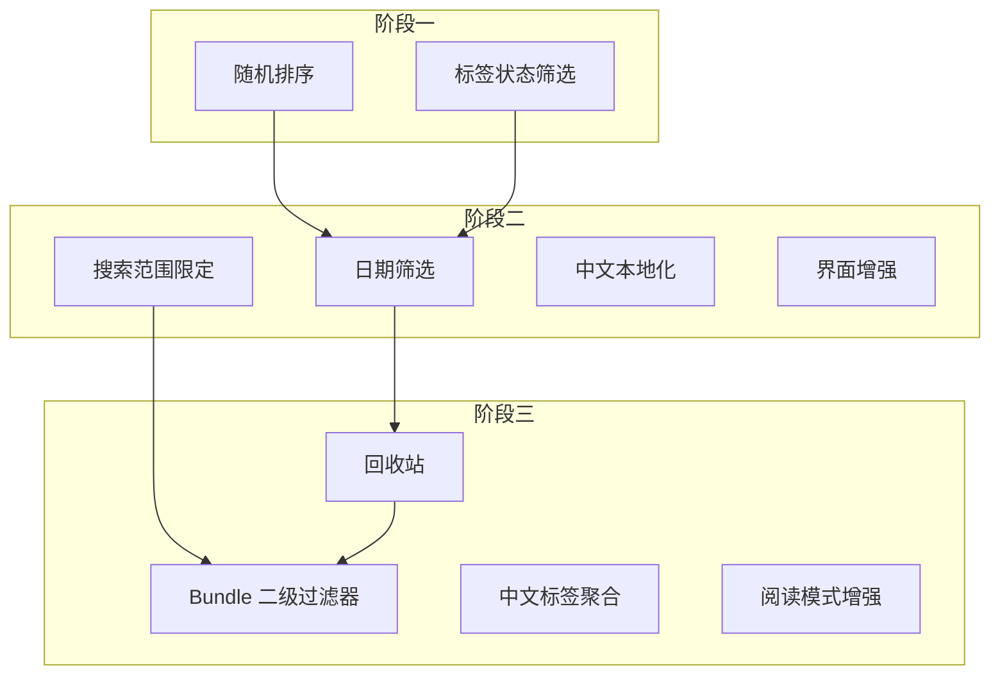

# linkding-cn 功能迁移计划

本文档基于 [linkding-cn-merge-analysis.md](linkding-cn-merge-analysis.md) 中的分析，列出各功能的详细迁移步骤与涉及文件。

---

## 迁移原则

- 以当前项目（linkding 1.45.0）为基础，按功能逐项迁移
- 每个功能独立分支，迁移后单独测试
- 优先迁移低依赖、高价值功能
- 适配 Django 6、Python 3.13、pyproject.toml

---

## 阶段一：低难度功能（预估 2–4 天）

### 1. 随机排序

**难度**：低 | **依赖**：无

| 步骤 | 操作 | 涉及文件 |
|------|------|----------|
| 1 | 新增排序常量 | [bookmarks/models.py](bookmarks/models.py) `BookmarkSearch` |
| 2 | 扩展 `params`、`defaults`、`__init__` | 同上 |
| 3 | 实现随机排序逻辑 | [bookmarks/queries.py](bookmarks/queries.py) `_base_bookmarks_query` |
| 4 | 表单增加排序选项 | [bookmarks/forms.py](bookmarks/forms.py) `BookmarkSearchForm` |
| 5 | 模板/前端增加排序控件 | 搜索相关模板 |
| 6 | 单元测试 | `bookmarks/tests/` |

**实现要点**：`order_by("?")` 实现随机，注意分页时保持同一随机序列（可用 `seed` 或缓存）。

---

### 2. 标签状态筛选（有标签/无标签）

**难度**：低 | **依赖**：无

| 步骤 | 操作 | 涉及文件 |
|------|------|----------|
| 1 | 新增 `FILTER_TAGGED_*` 常量 | [bookmarks/models.py](bookmarks/models.py) `BookmarkSearch` |
| 2 | 扩展 `params`、`defaults`、`__init__` | 同上 |
| 3 | 查询中增加 tagged 过滤 | [bookmarks/queries.py](bookmarks/queries.py) |
| 4 | 表单增加 tagged 选项 | [bookmarks/forms.py](bookmarks/forms.py) |
| 5 | 模板增加筛选控件 | 搜索相关模板 |
| 6 | 单元测试 | `bookmarks/tests/` |

**实现要点**：`tagged=yes` 用 `Q(tags__isnull=False)`，`tagged=no` 用 `Q(tags__isnull=True)`，注意去重。

---

## 阶段二：中等难度功能（预估 4–8 天）

### 3. 日期筛选（绝对日期 + 相对日期）

**难度**：中 | **依赖**：`python-dateutil`（可选，可用标准库）

| 步骤 | 操作 | 涉及文件 |
|------|------|----------|
| 1 | 新增 `date_filter_by`、`date_filter_type`、`date_filter_start`、`date_filter_end`、`date_filter_relative_string` | [bookmarks/models.py](bookmarks/models.py) `BookmarkSearch` |
| 2 | 实现 `parse_relative_date_string`（today、yesterday、this_week、last_N_days 等） | 同上 |
| 3 | 在 `_base_bookmarks_query` 中应用日期过滤 | [bookmarks/queries.py](bookmarks/queries.py) |
| 4 | 表单增加日期选择控件 | [bookmarks/forms.py](bookmarks/forms.py) |
| 5 | 模板增加日期筛选 UI | 搜索相关模板 |
| 6 | 单元测试 | `bookmarks/tests/` |

**实现要点**：参考 linkding-cn 的 `BookmarkSearch.parse_relative_date_string`，支持 `today`、`yesterday`、`this_week`、`this_month`、`last_N_days` 等。

---

### 4. 搜索范围限定（标题、描述、笔记、URL）

**难度**：中 | **依赖**：无

| 步骤 | 操作 | 涉及文件 |
|------|------|----------|
| 1 | 扩展搜索语法，支持 `in:title`、`in:description`、`in:notes`、`in:url` | [bookmarks/services/search_query_parser.py](bookmarks/services/search_query_parser.py) |
| 2 | 在 `_convert_ast_to_q_object` 中根据 scope 限定搜索字段 | [bookmarks/queries.py](bookmarks/queries.py) |
| 3 | 文档与 UI 提示新语法 | 搜索模板、文档 |

**实现要点**：当前 `TermExpression` 已搜索 title/description/notes/url，需增加可选的 scope 参数，由解析器传入。

---

### 5. 中文本地化

**难度**：中 | **依赖**：无（Django 内置）

| 步骤 | 操作 | 涉及文件 |
|------|------|----------|
| 1 | 为所有用户可见字符串添加 `gettext`/`gettext_lazy` | 模板 ``、``；Python 中 `gettext_lazy` |
| 2 | 创建中文 locale | `bookmarks/locale/zh_Hans/LC_MESSAGES/` |
| 3 | 运行 `makemessages`、`compilemessages` | - |
| 4 | 配置 `LANGUAGES`、`LOCALE_PATHS` | [bookmarks/settings/base.py](bookmarks/settings/base.py) |
| 5 | 用户/系统语言选择（可选） | UserProfile 或环境变量 |

**涉及范围**：`bookmarks/templates/`、`bookmarks/forms.py`、`bookmarks/models.py`（choices 文本）、`bookmarks/views/`、`bookmarks/admin.py`。

---

### 6. 界面增强（粘性、滚动、折叠记忆）

**难度**：中 | **依赖**：无

| 步骤 | 操作 | 涉及文件 |
|------|------|----------|
| 1 | UserProfile 增加 `sticky_header_controls`、`sticky_side_panel` | [bookmarks/models.py](bookmarks/models.py) |
| 2 | 数据库迁移 | `bookmarks/migrations/` |
| 3 | 设置页增加选项 | [bookmarks/views/settings.py](bookmarks/views/settings.py)、设置模板 |
| 4 | CSS 粘性样式 | [bookmarks/styles/](bookmarks/styles/) |
| 5 | 前端折叠状态记忆（sessionStorage） | [bookmarks/frontend/](bookmarks/frontend/) |

**实现要点**：`position: sticky`、`overflow` 独立滚动、`sessionStorage` 存折叠状态。

---

## 阶段三：高难度功能（预估 6–12 天）

### 7. 回收站

**难度**：高 | **依赖**：无

| 步骤 | 操作 | 涉及文件 |
|------|------|----------|
| 1 | Bookmark 增加 `is_deleted`、`date_deleted` | [bookmarks/models.py](bookmarks/models.py) |
| 2 | 数据库迁移 | `bookmarks/migrations/` |
| 3 | 默认查询排除 `is_deleted=True` | [bookmarks/queries.py](bookmarks/queries.py) |
| 4 | 新增 `query_trashed_bookmarks` | 同上 |
| 5 | 删除改为软删除 | [bookmarks/views/bookmarks.py](bookmarks/views/bookmarks.py) `remove`、[bookmarks/services/bookmarks.py](bookmarks/services/bookmarks.py) `delete_bookmarks` |
| 6 | 新增回收站视图、路由 | [bookmarks/urls.py](bookmarks/urls.py)、views |
| 7 | 新增还原、永久删除接口 | views、services |
| 8 | BookmarkSearch 增加 `SORT_DELETED_*`、`deleted_since` | [bookmarks/models.py](bookmarks/models.py) |
| 9 | UserProfile 增加 `trash_search_preferences` | 同上 |
| 10 | 回收站模板、批量操作 | 模板、handle_action |
| 11 | API 支持 | [bookmarks/api/](bookmarks/api/) |
| 12 | 单元测试、E2E 测试 | `bookmarks/tests/` |

**实现要点**：所有 `Bookmark.objects.filter()` 需统一排除 `is_deleted=True`，回收站视图单独查询 `is_deleted=True`。

---

### 8. Bundle 二级过滤器与 search_params

**难度**：高 | **依赖**：回收站、日期筛选等（若已迁移）

| 步骤 | 操作 | 涉及文件 |
|------|------|----------|
| 1 | BookmarkBundle 增加 `show_count`、`is_folder`、`search_params` (JSONField) | [bookmarks/models.py](bookmarks/models.py) |
| 2 | 与现有 `filter_unread`、`filter_shared` 兼容：迁移或并存 | 需设计：保留现有字段或迁移到 search_params |
| 3 | 实现 `bundle.search_object` 返回 BookmarkSearch | 同上 |
| 4 | 修改 `_filter_bundle` 使用 search_params | [bookmarks/queries.py](bookmarks/queries.py) |
| 5 | Bundle 表单、模板支持二级结构与 search_params 编辑 | [bookmarks/views/bundles.py](bookmarks/views/bundles.py)、模板 |
| 6 | 单元测试 | `bookmarks/tests/` |

**实现要点**：linkding-cn 用 `search_params` 替代了 `filter_unread`/`filter_shared`，当前项目 #1308 已加这两字段，需统一设计避免重复。

---

### 9. 中文标签聚合（pypinyin）

**难度**：中高 | **依赖**：`pypinyin`

| 步骤 | 操作 | 涉及文件 |
|------|------|----------|
| 1 | 添加 `pypinyin` 到 pyproject.toml | [pyproject.toml](pyproject.toml) |
| 2 | 标签分组逻辑：英文按首字母，中文按拼音首字母 | [bookmarks/views/contexts.py](bookmarks/views/contexts.py) 或 tag cloud 相关 |
| 3 | 模板渲染分组后的标签 | 标签云模板 |

**实现要点**：`pypinyin.lazy_pinyin` 获取拼音首字母，与英文字母分组逻辑合并。

---

### 10. 阅读模式增强（无快照也可阅读）

**难度**：中 | **依赖**：无

| 步骤 | 操作 | 涉及文件 |
|------|------|----------|
| 1 | 阅读模式入口不依赖 `latest_snapshot` | [bookmarks/views/bookmarks.py](bookmarks/views/bookmarks.py) 或 assets |
| 2 | 无快照时用 Readability 或 iframe 加载原 URL | [bookmarks/views/assets.py](bookmarks/views/assets.py) 或新建 view |
| 3 | 模板/前端允许无快照书签进入阅读模式 | 书签详情、阅读模式入口 |

---

### 11. 自定义元数据/快照脚本（drissionpage）

**难度**：高 | **依赖**：`drissionpage`（重依赖）

| 步骤 | 操作 | 涉及文件 |
|------|------|----------|
| 1 | 评估是否引入 drissionpage | 依赖体积、维护成本 |
| 2 | 配置支持自定义脚本路径 | 环境变量或 UserProfile |
| 3 | 元数据获取、快照任务调用自定义脚本 | [bookmarks/services/website_loader.py](bookmarks/services/website_loader.py)、[bookmarks/services/singlefile.py](bookmarks/services/singlefile.py) |
| 4 | 安全：脚本沙箱或白名单路径 | - |

**建议**：可延后或作为可选功能，优先完成其他迁移。

---

## 迁移顺序建议

**推荐实施顺序**：

1. 随机排序、标签状态筛选（快速见效）
2. 日期筛选、搜索范围限定
3. 中文本地化、界面增强
4. 回收站（核心功能）
5. Bundle 二级过滤器、中文标签聚合、阅读模式增强
6. 自定义脚本（可选）

---

## 工作量汇总

| 阶段 | 功能数 | 预估人天 | 风险 |
|------|--------|----------|------|
| 阶段一 | 2 | 2–4 | 低 |
| 阶段二 | 4 | 4–8 | 中 |
| 阶段三 | 4+ | 6–12 | 高 |
| **合计** | **10+** | **12–24** | - |

---

## 参考

- [linkding-cn GitHub](https://github.com/WooHooDai/linkding-cn)
- [linkding-cn-merge-analysis.md](linkding-cn-merge-analysis.md)
